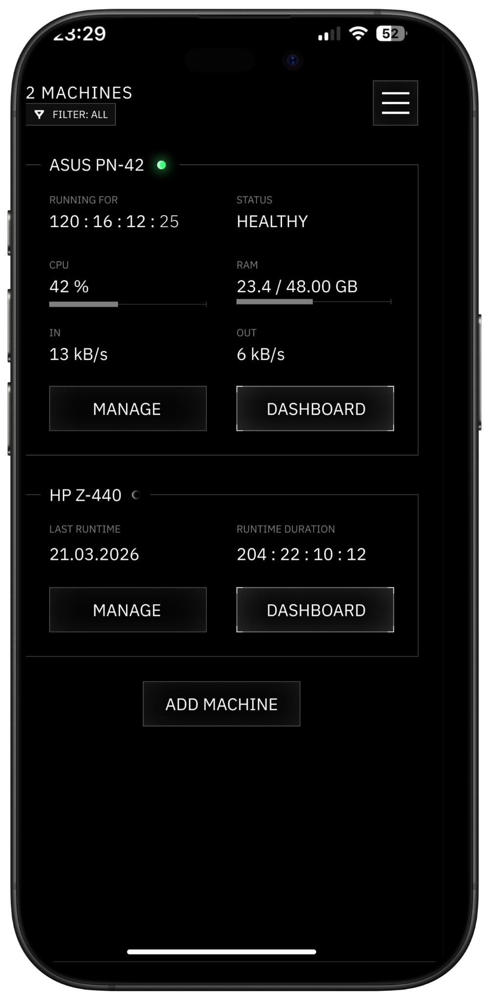
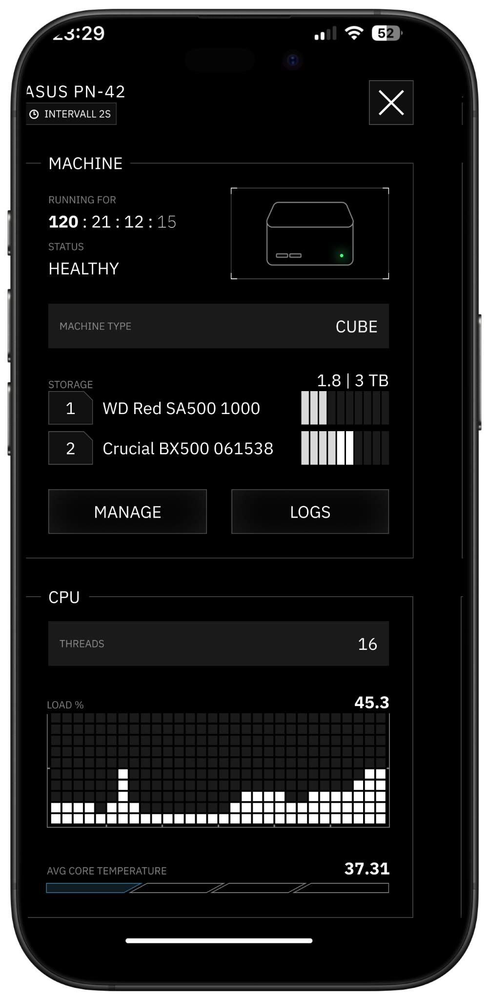

# Observer

A lightweight agent that runs on a server and collects system metrics. It periodically measures CPU usage, RAM, storage, uptime and runs speedtests, 
then streams the results to a central endpoint. You can also visit us on our [webseite](https://observe.vision/).

Documentation can also be found under [docs](https://observer-docs.observe.vision/).

<p align="center">
  
  
</p>

# Deploy

**One-liner install (recommended)**

```sh
curl -fsSL https://install.observe.vision | sudo bash
```

The script will interactively ask for your API key, then download the binary,
install the service, and write the config to `/etc/observer/observer.toml`.

The script auto-detects the init system. **systemd** (Ubuntu, Debian, ...) and **OpenRC** (Alpine Linux, ...) are both supported.

We are actively working also on the backend and there will be some downtime. The **observer** application running on
**your** device **shuts down after some time without a connection** to our backend,
so if you are experiencing issues and getting no metrics please just restart the agent with
`sudo systemctl restart observer` (or `sudo rc-service observer restart` on Alpine). If you install docker later on your machine please also restart the agent. The docker
metrics collector deactivates if it can't connect to a docker socket.

In further releases we will implement an auto-wakeup feature to prevent this.

# IMPORTANT: Updating / Wrong API Key

Run the installer again, it will detect the existing installation and prompt you to update the config
(pre-filled with current values), fix a wrong API key, and restart the service (should happen automatically after the
script finishes):

```sh
curl -fsSL https://install.observe.vision | sudo bash
```

**Useful commands (systemd)**

```sh
systemctl status observer     # check if running
systemctl restart observer    # restart
journalctl -u observer -f     # follow logs
journalctl -u observer -n 50  # last 50 log lines
```

**Useful commands (OpenRC / Alpine)**

```sh
rc-service observer status    # check if running
rc-service observer restart   # restart
tail -f /var/log/observer.log  # follow logs
```

# The config

The config lays in `/etc/observer/observer.toml`. There the api key can also be viewed and
changed. After a change please restart the service:

```sh
sudo nano /etc/observer/observer.toml     # edit config

sudo systemctl restart observer           # restart to apply changes

journalctl -u observer -f                 # follow logs to check if it works
```

When something doesn't work and you run into issues. Please feel free to write us a mail to **mail@observe.vision**.
We will reply as soon as possible and look into it.

---
# Contributing

We are actively looking for developers to join the project. Both for **Observer** (this agent) and for **Watch-Tower**,
our application that collects and provides the metrics to the dashboard.

If you are interested in contributing, feel free to open an issue, submit a pull request,
or reach out directly at **mail@observe.vision**. All skill levels are welcome.

---
# Manual deployment

Use this if you want to deploy without the install script, or on a system where it does not work.

**1. Build the binary**

```sh
cargo build --release
```

**2. Place the binary**

```sh
sudo cp target/release/observer /usr/local/bin/observer
sudo chmod +x /usr/local/bin/observer
```

**3. Create the config**

```sh
sudo mkdir -p /etc/observer
sudo cp observer.toml.example /etc/observer/observer.toml
sudo nano /etc/observer/observer.toml   # fill in your server URLs and API key
```

The config is read from `/etc/observer/observer.toml`. All available options are documented in `observer.toml.example`.

**4a. Install and enable the systemd service (Ubuntu, Debian, ...)**

```sh
sudo cp setup/observer.service /etc/systemd/system/observer.service
sudo systemctl daemon-reload
sudo systemctl enable observer
sudo systemctl start observer
```

**4b. Install and enable the OpenRC service (Alpine Linux, ...)**

```sh
sudo cp setup/observer.openrc /etc/init.d/observer
sudo chmod +x /etc/init.d/observer
sudo rc-update add observer default
sudo rc-service observer start
```

**Starting and stopping (systemd)**

```sh
sudo systemctl start observer    # start
sudo systemctl stop observer     # stop
sudo systemctl restart observer  # restart
```

**Starting and stopping (OpenRC)**

```sh
sudo rc-service observer start    # start
sudo rc-service observer stop     # stop
sudo rc-service observer restart  # restart
```

**Checking logs**

```sh
# systemd
journalctl -u observer -f                         # follow live logs
journalctl -u observer --since "1 hour ago"       # last hour

# OpenRC / Alpine
tail -f /var/log/observer.log                      # follow live logs

# any system
OBSERVER_LOG_LEVEL=debug /usr/local/bin/observer  # run manually with debug output
```
